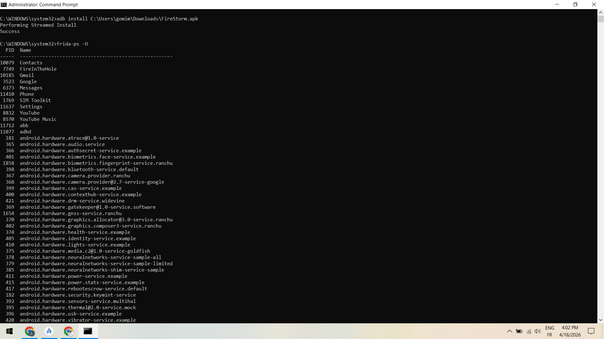
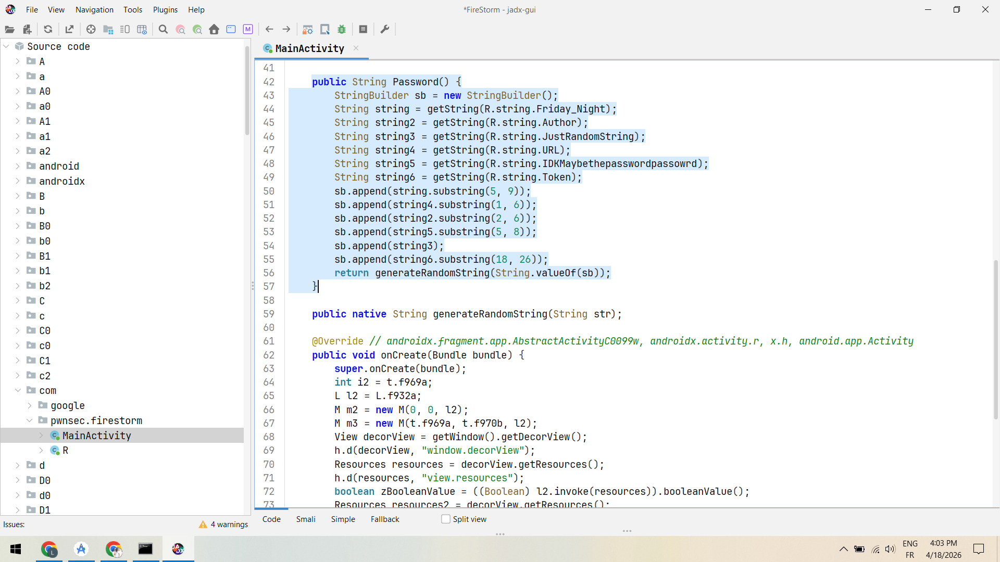
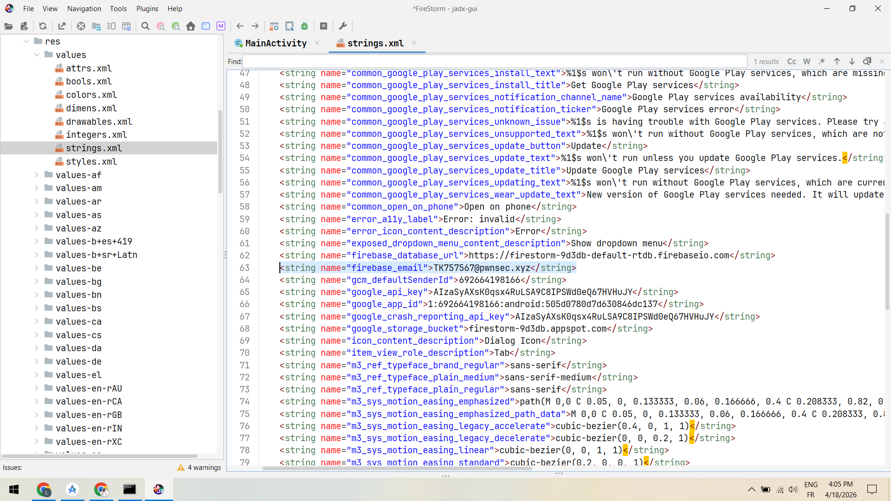
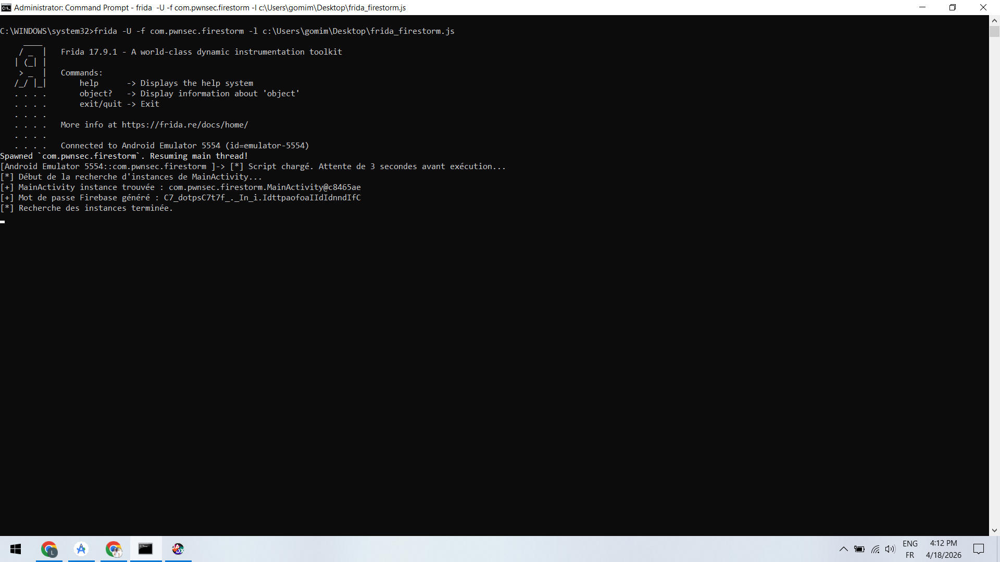
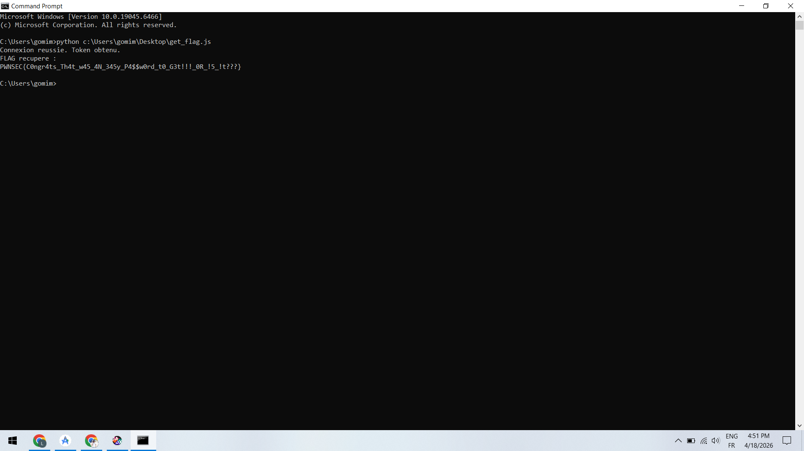

# lab18

# 📱 Lab 18 – Analyse de sécurité d’une application mobile (FireStorm)

## 🛠️ Outils utilisés

* **ADB (Android Debug Bridge)**
* **Frida**
* **JADX (Reverse Engineering)**
* **Émulateur Android**

---

## ⚙️ Étape 1 : Installation de l’application et Vérification des processus avec Frida

Installation de l’APK sur l’émulateur Android via ADB :

```bash
adb install FireStorm.apk
```

```bash
frida-ps -U
```

<p align="center">
  
</p>

---

## 🧠 Étape 2 : Analyse du code avec JADX

Décompilation de l’application pour comprendre la logique interne.

On identifie une fonction responsable de la génération du mot de passe dans `MainActivity`.

<p align="center">
  
</p>

---

## 📂 Étape 3 : Analyse du fichier strings.xml

Inspection des ressources pour trouver des informations sensibles :

* Email Firebase
* API Key
* URL de la base de données

<p align="center">
  
</p>

---

## ⚡ Étape 4 : Injection avec Frida

Utilisation d’un script Frida pour intercepter et exécuter dynamiquement la fonction de génération du mot de passe :

```bash
frida -U -f com.pwnsec.firestorm -l frida_firestorm.js
```

<p align="center">
  
</p>

---

## 🚨 Étape 5 : Récupération du flag

Connexion réussie et récupération du flag final :

<p align="center">
  
</p>

---

## ✅ Résultat final

✔ Mot de passe récupéré avec succès
✔ Accès Firebase obtenu
✔ Flag extrait

---

## 🧠 Conclusion

Ce lab démontre l’importance de :

* Ne pas stocker d’informations sensibles dans les ressources
* Protéger le code contre le reverse engineering
* Éviter l’exposition des clés API
* Sécuriser les fonctions critiques contre l’instrumentation dynamique

---


